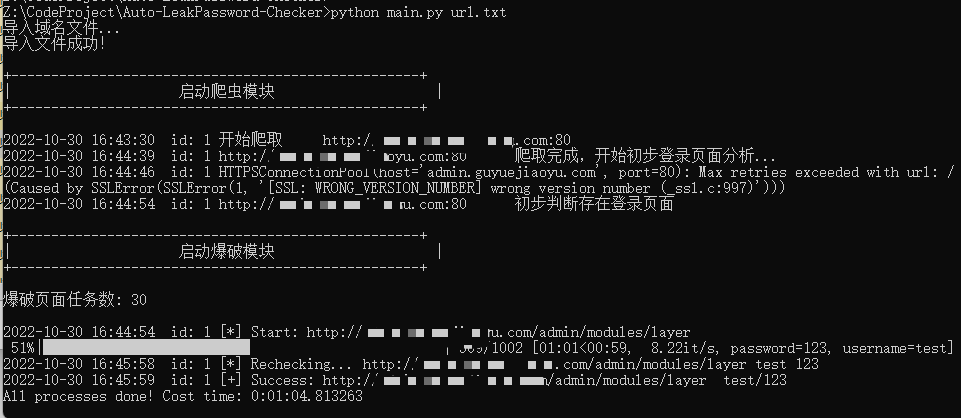

# 批量自动化弱口令检查工具
基于企业内网繁杂的弱口令检测需求，
缝合crawlergo爬虫+WebCrack项目而开发的一个批量自动化弱口令检查工具

本项目基于
[crawlergo](https://github.com/Qianlitp/crawlergo)
与 [WebCrack](https://github.com/yzddmr6/WebCrack)
与 [HTMLSimilarity](https://github.com/SPuerBRead/HTMLSimilarity)
构建
感谢以上项目师傅们的付出！

### 工具特性
* 智能发现登录入口，自动识别登录框并发送弱口令爆破
* 支持批量导入功能

(来自webcrack的特性）

* 多重判断机制，减少误报
* 随机UA 随机X-Forwarded-For 随机Client-IP
* 可以通过域名生成动态字典
* 可以检测万能密码漏洞
* 支持自定义爆破规则

----
## 使用方法
运行需python版本3.7+

本项目仅在windows平台下测试通过，其他平台需自行配置crawlergo与chrome浏览器


安装依赖
```
pip3 install -r requirements.txt
```

URL域名按行写入文件，运行脚本后加入文件名即可进行批量域名爆破，支持.txt、.xls格式。不附加文件名参数时，默认读取url.txt文件
```
python3 main.py url.txt
```
爆破的结果会保存在`result/{date}/`文件夹中

支持自定义设置代理等，在common_config.py中进行设置

支持自定义爆破字典等，在auto_login/conf中进行设置

----

## 工具说明

本程序主要又以下主要模块构成：
### 输入格式化模块 input_format
整理输入的网站列表，对其格式化处理

### crawlergo爬虫模块 crawl_spider
使用结合crawlergo，爬虫动态爬取页面，并初步判断是否为登录页面

### webcrack爆破模块 auto_login
爆破模块会自动化识别登录参数，尝试利用web后台弱口令/万能密码批量检测工具，调用该函数即可进行自动化检测。

### logs日志模块 logs
记录爆破成功/失败等信息，并将结果输出至result文件夹中

----
## 演示案例：

----

## 警告！

**请勿用于非法用途！否则自行承担一切后果**
